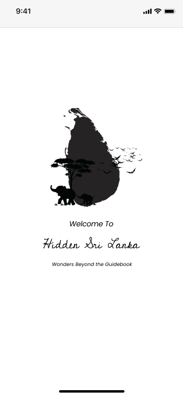
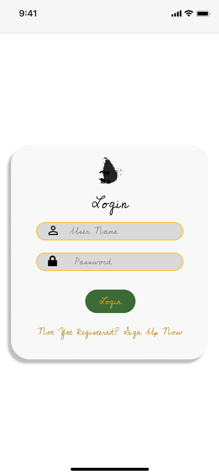
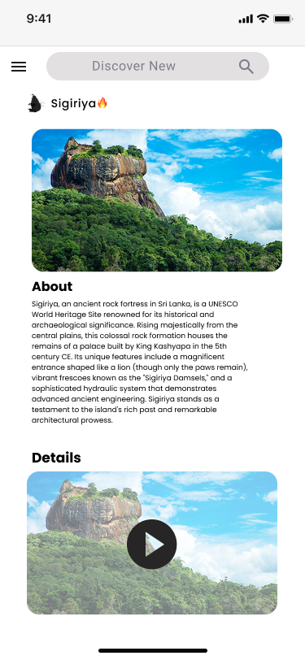

# Hidden Sri Lanka 🇱🇰

> Discover the wonders beyond the guidebook

A mobile application for discovering hidden gems and lesser-known attractions across Sri Lanka, powered by community contributions and location-based recommendations.

## 📱 Features

- **🌍 Location-Based Discovery**: Automatically detects your location and shows nearby attractions
- **🔍 Smart Filtering**: Filter attractions by categories (Historical Sites, Waterfalls, Beaches, etc.)
- **➕ Community Contributions**: Add new hidden gems to help fellow travelers
- **🔐 Persistent Login**: Stay logged in across app sessions
- **📍 Manual Search**: Search for attractions in specific Sri Lankan cities
- **📱 Modern UI**: Clean, intuitive Material Design interface

## 🚀 Quick Start

### Prerequisites
- Android Studio Arctic Fox (2020.3.1) or newer
- Android SDK API 21+ (Android 5.0+)
- Firebase account for backend services

### Installation
1. **Clone the repository**
   ```bash
   git clone https://github.com/your-username/Hidden-Sri-Lanka.git
   cd Hidden-Sri-Lanka
   ```

2. **Setup Firebase**
   - Create a Firebase project
   - Add your `google-services.json` to `app/` directory
   - Enable Firestore and Realtime Database
   - Configure authentication

3. **Build and Run**
   ```bash
   ./gradlew clean build
   ./gradlew installDebug
   ```

## 📚 Documentation

### Core Features
- [🔐 Authentication System](docs/features/authentication.md) - Login, signup, and session management
- [🏠 Home & Discovery](docs/features/home-discovery.md) - Location detection and attraction browsing
- [🔍 Filtering System](docs/features/filtering.md) - Category-based attraction filtering
- [📍 Location Details](docs/features/location-details.md) - Detailed attraction information
- [➕ Add Locations](docs/features/add-locations.md) - Community contribution system
- [🧭 Navigation](docs/features/navigation.md) - App navigation and menu system

### Setup & Development
- [⚙️ Installation Guide](docs/setup/installation.md) - Complete setup instructions
- [🔥 Firebase Integration](docs/setup/firebase.md) - Backend configuration
- [🏗️ Architecture](docs/setup/architecture.md) - App structure and design patterns
- [📡 API Reference](docs/api/endpoints.md) - Firebase collections and data models

### User Guides
- [🚀 Getting Started](docs/guides/getting-started.md) - First-time user guide
- [🤝 Contributing Locations](docs/guides/contributing.md) - How to add new attractions
- [🔧 Troubleshooting](docs/guides/troubleshooting.md) - Common issues and solutions

## 🏗️ Architecture

```
┌─────────────────────────────────────────┐
│                View Layer               │
│  Activities, Layouts, Adapters         │
├─────────────────────────────────────────┤
│              Controller Layer           │
│  BaseActivity, Session Management      │
├─────────────────────────────────────────┤
│                Model Layer              │
│  Data Classes, Firebase Integration     │
└─────────────────────────────────────────┘
```

### Key Components
- **BaseActivity Pattern**: Consistent navigation and session management
- **SessionManager**: Persistent login with SharedPreferences
- **Firebase Integration**: Firestore for attractions, Realtime DB for users
- **Location Services**: GPS-based attraction discovery

## 🛠️ Tech Stack

- **Android**: Native Android with Java
- **UI Framework**: Material Design Components
- **Backend**: Firebase (Firestore + Realtime Database)
- **Authentication**: Custom Firebase authentication
- **Location**: Google Play Services Location API
- **Image Loading**: Glide
- **Build System**: Gradle with Kotlin DSL

## 📊 Project Status

### ✅ Completed Features
- [x] User authentication (login/signup)
- [x] Persistent login sessions
- [x] Location-based attraction discovery
- [x] Category filtering system
- [x] Add new locations feature
- [x] Navigation drawer with menu
- [x] Search functionality
- [x] Community contribution system

### 🚧 In Development
- [ ] Google Maps integration
- [ ] User profiles and preferences
- [ ] Favorites system
- [ ] Photo upload functionality
- [ ] Dark theme support

### 🗺️ Future Plans
- [ ] Offline map support
- [ ] User reviews and ratings
- [ ] Social features (follow travelers)
- [ ] Advanced search filters
- [ ] Multi-language support
- [ ] AR features for attraction discovery

## 🤝 Contributing

We welcome contributions from the community! Here's how you can help:

### Adding Attractions
1. Use the "Add Location" feature in the app
2. Provide detailed descriptions and quality images
3. Follow our [Contributing Guidelines](docs/guides/contributing.md)

### Code Contributions
1. Fork the repository
2. Create a feature branch (`git checkout -b feature/amazing-feature`)
3. Commit your changes (`git commit -m 'Add amazing feature'`)
4. Push to the branch (`git push origin feature/amazing-feature`)
5. Open a Pull Request

### Bug Reports
- Use GitHub Issues to report bugs
- Include device model, Android version, and steps to reproduce
- Check [Troubleshooting Guide](docs/guides/troubleshooting.md) first

## 📱 Screenshots

| Splash Screen | Home Screen | Add Location |
|---------------|-------------|--------------|
|  |  |  |

| Login | Location Details | Navigation |
|-------|------------------|------------|
|  |  |  |

## 📄 License

This project is licensed under the MIT License - see the [LICENSE](LICENSE) file for details.

## 👥 Team

**Developer**: S23010526  
**University**: OUSl (Open University Of Sri Lanka) </br>
**Course**: Mobile Application Development  

## 🙏 Acknowledgments

- **Firebase** for providing robust backend services
- **Material Design** for the beautiful UI components

## 📞 Support

- **Documentation**: Check our comprehensive [docs](docs/)
- **Issues**: Use GitHub Issues for bug reports
- **Contact**: Through app's "About Us" section

## 🌟 Show Your Support

If you find this project helpful, please consider:
- ⭐ Starring the repository
- 🐛 Reporting bugs and issues
- 🗺️ Contributing new attraction locations
- 📢 Sharing with fellow travelers

---

**Made with ❤️ for Sri Lankan travelers and adventure seekers**

*Discover the island's hidden treasures, one location at a time* 🌴
