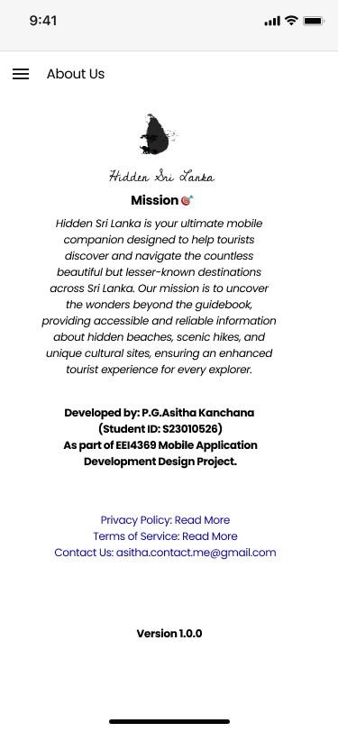
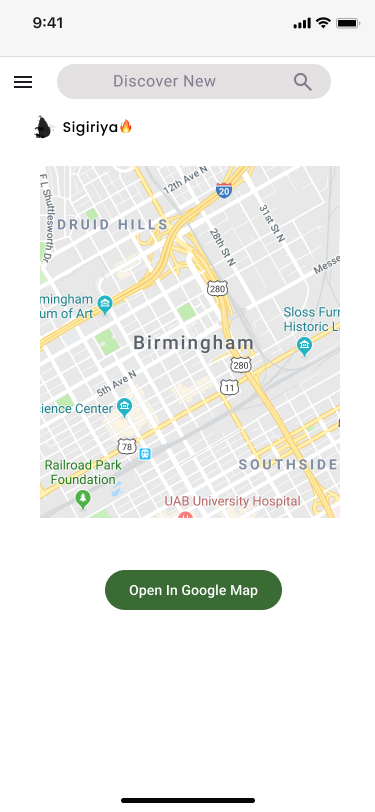
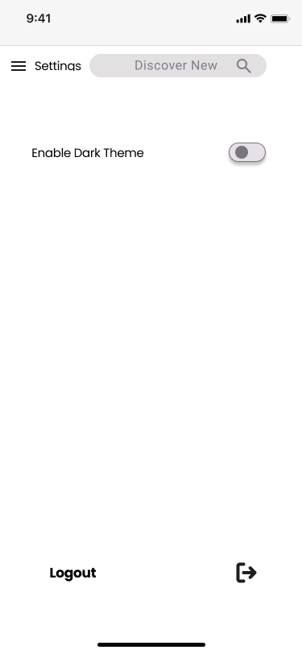
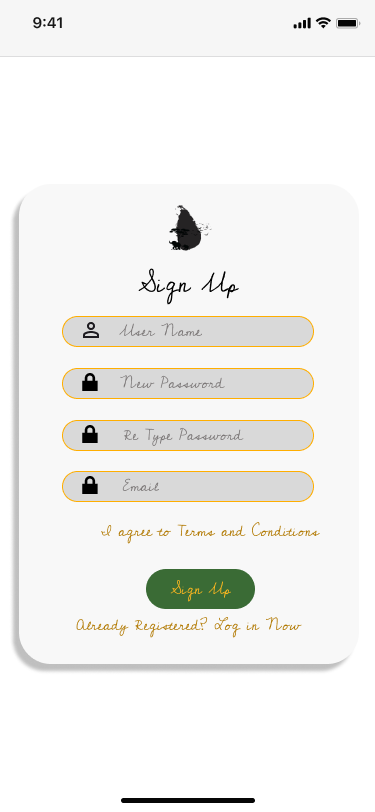
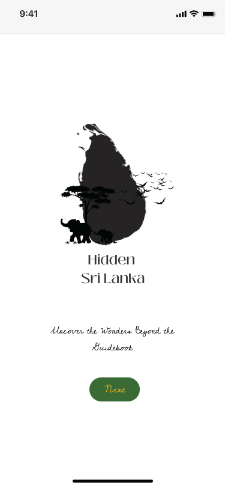

# Hidden Sri Lanka Mobile App
Welcome to the official repository for Hidden Sri Lanka, your ultimate mobile guide to uncovering the undiscovered gems of Sri Lanka! This app is designed to help tourists explore beautiful, lesser-known destinations beyond the typical guidebook.

## 🎨 Image Gallery
Here’s a glimpse into the app's design and user interface.

| About Us         | Explore and Share          | Home Screen                    |
|------------------|---------------------------|-------------------------------|
|  |  |  |

| Location Details         | Login           | Map                       |
|-------------------------|-----------------|---------------------------|
|  |  |  |

| Settings          | Side Panel           | Sign Up                   |
|-------------------|---------------------|---------------------------|
|  |  |  |

| Splash Screen           | Welcome Screen          |
|------------------------|------------------------|
|  |  |

## 🎯 About The Project
Hidden Sri Lanka is your ultimate mobile companion designed to help tourists discover and navigate the countless beautiful but lesser-known destinations across Sri Lanka. Our mission is to uncover the wonders beyond the guidebook, providing accessible and reliable information about hidden beaches, scenic hikes, and unique cultural sites, ensuring an enhanced tourist experience for every explorer.

## ✨ Key Features

- **User Authentication 🔑**: Secure sign-up and login functionality using Firebase Realtime Database.

- **Dynamic Home Page 🏞️:** Displays a list of nearby attractions fetched from a Firestore database based on the user's current city.

- **Location-Based Discovery 📍**: Utilizes the device's location to find and suggest local points of interest.

- **Category Filtering 🗂️:** Users can filter attractions by categories such as "Historical Site," "WaterFall," and more.

- **Interactive Map View 🗺️**: An integrated map to explore all locations visually. (Feature in development).

- **Favorites System ❤️**: Ability for users to save their favorite attractions. (Feature in development).

- **Centralized Navigation 🧭**: A smooth and consistent user experience with a navigation drawer and a shared BaseActivity.

- **Search Functionality 🔍**: A search bar is integrated into the toolbar for finding specific locations.

## 🛠️ Technologies Used

This project is built using a variety of modern Android development technologies:

**Language:**

- Java

**Architecture:**

Activity-based structure with a central BaseActivity for shared UI and logic.

**Database:**

- Firebase Realtime Database: For user authentication and data storage.

- Cloud Firestore: For storing and querying attraction data.

**Android Components:**

- RecyclerView with CardView for displaying lists of attractions.

- DrawerLayout and NavigationView for the side menu.

- Toolbar for a consistent action bar.

- Google Maps API for map-related features.

### Libraries:

- **Glide**: For efficient image loading and caching from URLs.

- **Google Play Services (Location)**: To get the user's current location.

- **Material Components for Android**: For modern UI elements like ChipGroup and MaterialButton.

## 🗄️ Project Structure
The project is organized into several key components:

**Activities**: Each screen is an Activity (e.g., HomeActivity, LoginActivity, AboutUsActivity).

**BaseActivity.java**: An abstract base class that all other activities extend. It contains the common logic for the navigation drawer, toolbar, and options menu, reducing code duplication.

**AttractionAdapter.java**: A RecyclerView.Adapter responsible for binding the Attraction data to the list items displayed on the home screen.

### Data Models:

**Attraction.java**: A POJO class representing a single tourist attraction.

**HelperClass.java**: A helper class for structuring user data for Firebase Realtime Database.

**Layouts (.xml)**: All UI layouts are defined in XML, including activities, list items, and menus.

**Resources**: Contains all non-code assets, such as strings (strings.xml), colors (colors.xml), and styles (styles.xml).

## 💾 Database Information
The application utilizes two separate Firebase databases for different purposes:

<i>Firebase Realtime Database</i>

**Purpose**: Manages user accounts (username, email, password).

**Structure**: User data is stored under a users node, with each user identified by their username.

- **Cloud Firestore**

Purpose: Stores and serves all the data related to tourist attractions.

Structure: Data is organized by city. Each city is a document within a cities collection, and each city document contains an attractions sub-collection. This allows for efficient querying of attractions based on a specific city.

## 👨‍💻 Developer
Name: Asitha Kanchana Palliyaguru  
This project was developed as part of the EEI4369 Mobile Application Development Design Project.