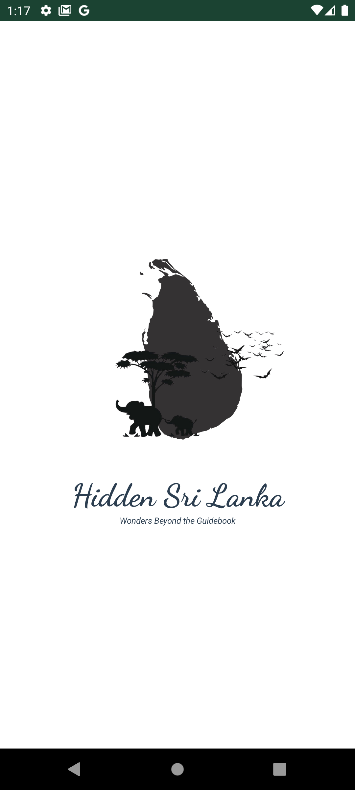
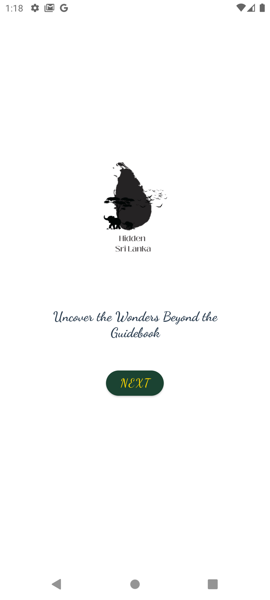
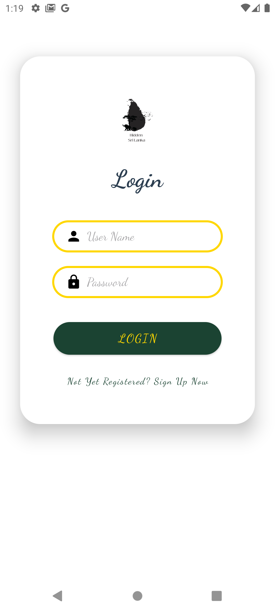
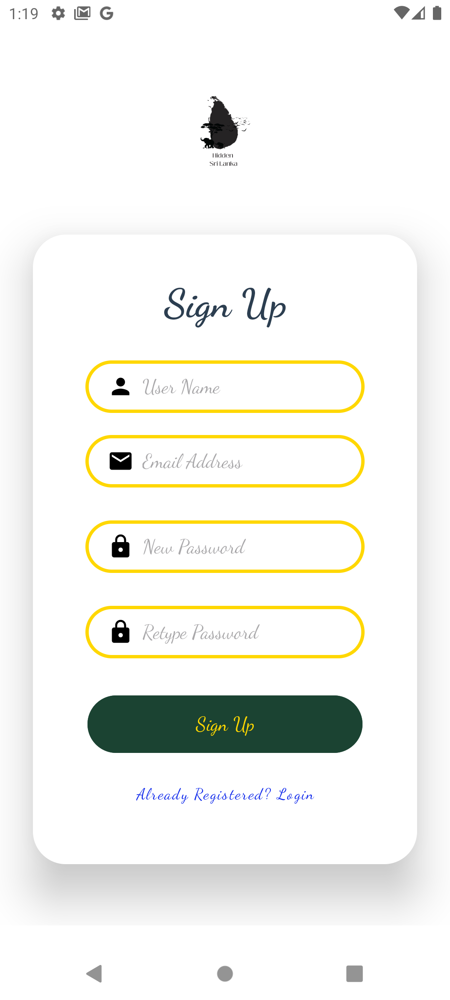
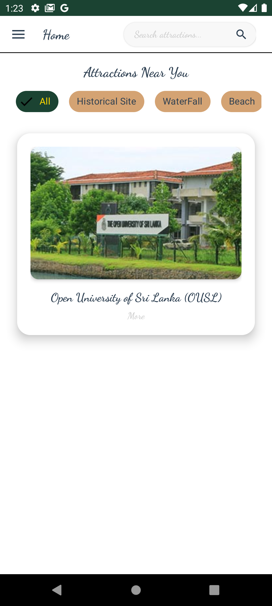
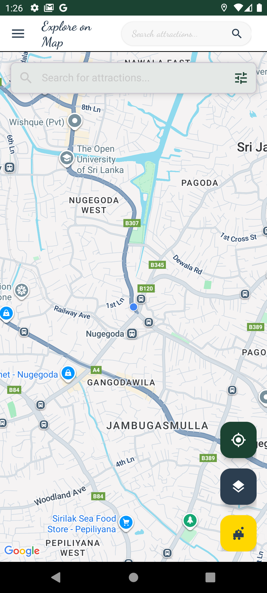
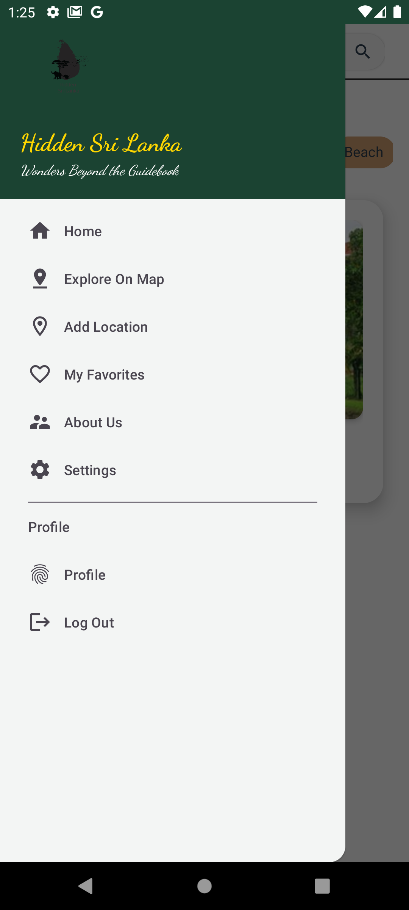
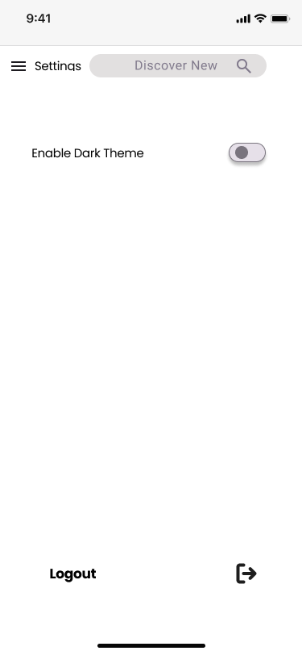
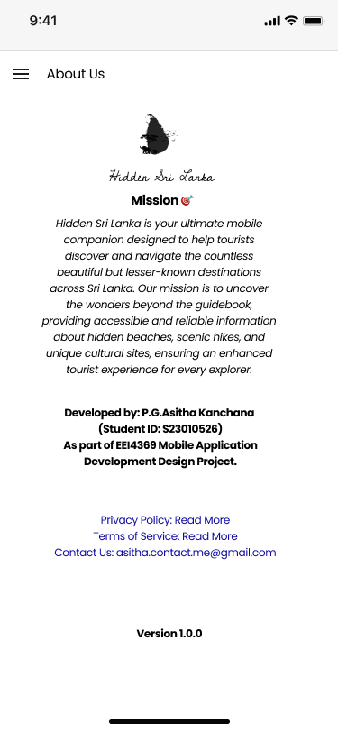

# Hidden Sri Lanka Mobile App

> 📚 Looking for the docs? Jump straight in: **[➡️ Full Documentation Index](docs/README.md)**

Quick Docs Shortcuts:

| Getting Started | Architecture | Features | API | Design System | Contributing |
|-----------------|-------------|----------|-----|---------------|--------------|
| [Setup Guide](docs/guides/getting-started.md) | [Architecture](docs/setup/architecture.md) | [All Features](docs/features/home-discovery.md) | [Endpoints](docs/api/endpoints.md) | [UI System](docs/design-system.md) | [Contribute](docs/guides/contributing.md) |


---

## 📱 Android Application Module

This directory contains the main Android application code for the Hidden Sri Lanka project, developed as part of my Mobile Application Development course at OUSL.

## 📚 Documentation

This project includes comprehensive documentation to help you understand, setup, and contribute to the Hidden Sri Lanka mobile application.

### 📖 Getting Started

- **[Getting Started Guide](docs/guides/getting-started.md)** - Step-by-step setup instructions
- **[Installation Guide](docs/setup/installation.md)** - Detailed installation procedures
- **[Firebase Setup](docs/setup/firebase.md)** - Firebase configuration and setup
- **[Architecture Overview](docs/setup/architecture.md)** - Project architecture and design patterns
- **[Firebase Google Services Setup](docs/setup/firebase-google-services-setup.md)** - Adding google-services.json & configuring Gradle

### 🚀 Features Documentation

- **[Home & Discovery](docs/features/home-discovery.md)** - Main screen functionality and location discovery
- **[Location Details](docs/features/location-details.md)** - Detailed view implementation and features
- **[Add Locations](docs/features/add-locations.md)** - Community contribution and location submission
- **[Authentication](docs/features/authentication.md)** - User login and account management
- **[Filtering System](docs/features/filtering.md)** - Search and filter functionality
- **[Google Photos Integration](docs/features/google-photos-integration.md)** - Image handling and Google Photos API
- **[Navigation System](docs/features/navigation.md)** - Maps integration and directions

### 🔧 API & Technical Reference

- **[API Endpoints](docs/api/endpoints.md)** - Backend API documentation and usage
- **[API Key Setup](docs/api/API_KEY_SETUP.md)** - Managing and securing API keys
- **[Design System](docs/design-system.md)** - UI/UX guidelines and component library

### 🤝 Contributing & Support

- **[Contributing Guide](docs/guides/contributing.md)** - How to contribute to the project
- **[Troubleshooting](docs/guides/troubleshooting.md)** - Common issues and solutions
- **[Toast Message Guidelines](docs/guides/toast-message-guidelines.md)** - Consistent in-app messaging standards
- **[Background Threading](docs/Explain/BackgroudTreding.md)** - Threading model & best practices
- **[Test Cases Reference](docs/Explain/test-cases.md)** - Manual / scenario-based testing list
- **[Viva Guide](docs/viva-guide.md)** - Academic presentation and defense preparation (overview)

### 🔐 Firebase & Security

- **[Firestore Rules](docs/firestore-rules.txt)** - Database access control
- **[Storage Rules](docs/firebase-storage-rules.txt)** - Media storage security
- **[API Key Setup](docs/api/API_KEY_SETUP.md)** - (Duplicate for quick access) Key management

### 📋 Additional Resources

- **[Project Documentation README](docs/README.md)** - Documentation overview and structure

## 📱 App Screenshots

### Main Application Flow

<div align="center">

| Splash Screen | Welcome Screen | Login Screen |
|:-------------:|:--------------:|:------------:|
|  |  |  |

| Sign Up | Home Screen | Location Details |
|:-------:|:-----------:|:----------------:|
|  |  |  |

</div>

### Core Features

<div align="center">

| Map Integration | Side Panel | Settings |
|:---------------:|:----------:|:--------:|
|  |  |  |

| Explore & Share | About Us | App Icon |
|:---------------:|:--------:|:--------:|
|  |  |  |

</div>

## 🏗️ Project Structure

```text
app/
├── src/main/java/com/s23010526/hiddensrilanka/
│   ├── Activities/
│   │   ├── MainActivity.java
│   │   ├── HomeActivity.java
│   │   ├── LocationDetailActivity.java
│   │   ├── AddLocationActivity.java
│   │   └── LoginActivity.java
│   ├── Adapters/
│   │   └── AttractionAdapter.java
│   ├── Models/
│   │   └── Attraction.java
│   ├── Helpers/
│   │   └── GooglePhotosUrlHelper.java
│   └── Utils/
└── src/main/res/
    ├── layout/
    ├── values/
    └── drawable/
```

## 🔧 Technical Implementation

### Core Components

#### Activities

- **HomeActivity**: Location detection, attraction display, and filtering
- **LocationDetailActivity**: Detailed attraction view with intelligent directions
- **AddLocationActivity**: Community contribution form with Google Photos integration
- **LoginActivity**: Authentication and session management

#### Key Classes

- **AttractionAdapter**: RecyclerView adapter with proper intent data passing
- **GooglePhotosUrlHelper**: URL processing for seamless image integration
- **Attraction**: Data model with comprehensive field mapping

### Recent Development Work

#### Bug Fixes Implemented

1. **Intent Data Passing Issue** (Fixed: August 2025)
   - Problem: Location details page showing empty data
   - Solution: Corrected intent extra keys between activities
   - Files modified: `AttractionAdapter.java`, `LocationDetailActivity.java`

2. **Google Photos Image Loading** (Fixed: August 2025)
   - Problem: Images not displaying in details page
   - Solution: Added URL processing to LocationDetailActivity
   - Files modified: `LocationDetailActivity.java`

3. **Directions Button Functionality** (Enhanced: August 2025)
   - Problem: Button not working when coordinates missing
   - Solution: Implemented three-level fallback system
   - Files modified: `LocationDetailActivity.java`

#### Technical Improvements

- **Smart Geocoding**: Automatic coordinate resolution for missing location data
- **Error Handling**: Comprehensive exception management across all activities
- **Background Processing**: Proper threading for network operations
- **Lambda Expression Fixes**: Resolved compilation issues with final variables

## 🎯 Learning Outcomes Demonstrated

### Android Development Skills

- **Activity Communication**: Proper intent usage and data passing
- **Lifecycle Management**: Handling activity states and background operations
- **UI/UX Design**: Material Design implementation with responsive layouts
- **Database Integration**: Firestore real-time data synchronization
- **Location Services**: GPS integration and geocoding API usage
- **Image Processing**: Efficient loading with Glide and URL conversion

### Problem-Solving Approach

- **Systematic Debugging**: Using logs and systematic testing to identify issues
- **Fallback Systems**: Implementing robust error recovery mechanisms
- **User Experience**: Ensuring functionality works under various conditions
- **Code Quality**: Proper variable scoping and lambda expression handling

## 🔥 Firebase Configuration

The app integrates with Firebase for:

- **Firestore Database**: Real-time attraction data storage
- **Authentication**: User login and session management
- **Security Rules**: Proper data access control

Configuration file: `google-services.json` (not included in repository for security)

## 🧪 Testing Approach

### Manual Testing Scenarios

- Location detection across different cities
- Image loading with various URL formats
- Directions functionality with and without coordinates
- Error handling under poor network conditions
- Cross-activity data flow validation

### Debug Implementation

- Comprehensive logging throughout the application
- Error state handling with user-friendly messages
- Performance monitoring for image loading and geocoding

## 📊 Performance Considerations

### Optimizations Implemented

- **Image Caching**: Glide library for efficient memory usage
- **Background Processing**: Non-blocking UI for network operations
- **Database Queries**: Efficient Firestore query structure
- **Memory Management**: Proper activity lifecycle handling

## 🚀 Build Configuration

- **Target SDK**: API 34 (Android 14)
- **Minimum SDK**: API 21 (Android 5.0)
- **Build Tools**: Gradle with modern Android build system
- **Dependencies**: Material Design, Firebase, Glide, Location Services

## 📝 Change Log

### August 2025

- **Intent Data Passing Fix**: Resolved empty details page issue
- **Google Photos Integration**: Enhanced image loading across all screens
- **Intelligent Directions**: Implemented geocoding fallback system
- **Error Handling**: Added comprehensive exception management
- **Code Quality**: Fixed lambda expression compilation issues

### June 2025

- **Initial Development**: GitHub repository initialization
- **Core Features**: Basic app structure and Firebase integration
- **Author**: Asitha Kanchana (Student ID: S23010526)

## 🎓 Academic Context

This mobile application demonstrates practical implementation of concepts learned in the Mobile Application Development course at OUSL, including:

- Modern Android development practices
- Real-time database integration
- Location-based services
- Image processing and optimization
- Error handling and user experience design
- Systematic debugging and problem-solving

---

**Developer**: Asitha Kanchana  
**Student ID**: S23010526  
**Institution**: Open University of Sri Lanka  
**Course**: Mobile Application Development  
**Degree**: Bachelor of Software Engineering
